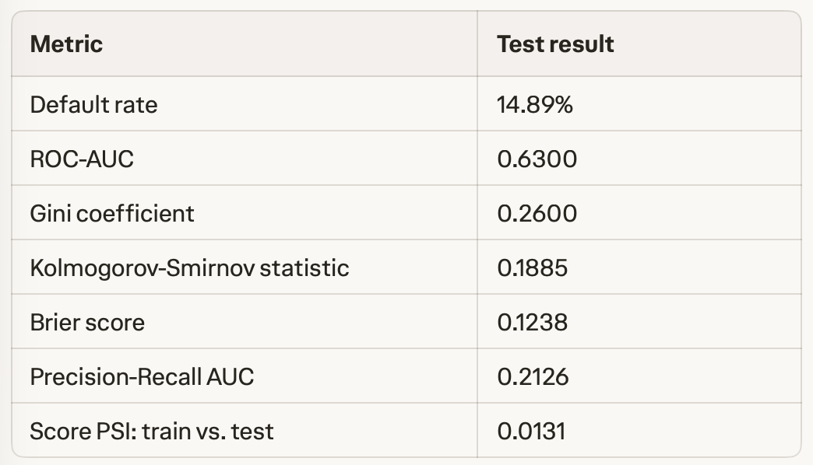

# Credit Risk Modeling and Credit Scoring

[Version française](README_FR.md)

An end-to-end credit risk modeling project using historical Lending Club accepted loan data. The project develops and compares an interpretable logistic scorecard and an XGBoost model to estimate the Probability of Default (PD) at loan origination.

> **Disclaimer:** This is an educational credit risk modeling project. It is not a production-ready credit decision system.

## Business Objective

The objective is to identify borrowers with a higher likelihood of default and support more consistent lending decisions through risk segmentation and calibrated PD estimates.

The target is a binary default indicator built from the loan outcome:

- `Fully Paid` = 0
- `Charged Off` = 1

Only information available at the time of loan origination is used, preventing data leakage from repayment, recovery, or post-origination variables.


## Project Structure
```text
credit-risk-scoring/
├── data/
│   ├── raw/                         # Original Lending Club data
│   └── processed/                   # Modeling-ready datasets
├── notebooks/
│   ├── 01_data_preparation.ipynb
│   ├── 02_eda.ipynb
│   ├── 03_scorecard_logistique.ipynb
│   ├── 04_xgboost.ipynb
│   └── 05_model_comparison_and_calibration.ipynb
├── outputs/
│   ├── figures/
│   ├── models/
│   └── tables/
├── src/p2/                          # Reusable Python modules
├── pyproject.toml                   # Project dependencies
└── README.md```


## Methodology

    1.	Data preparation: Inspect the raw source, retain loans with known outcomes, engineer origination-time features, and exclude post-origination information.

    2.	Exploratory data analysis: Analyze portfolio composition, default rates, missingness, distributions, and risk segmentation.

    3.	Interpretable benchmark: Build a logistic scorecard using Weight of Evidence (WoE) and Information Value (IV).

    4.	Machine-learning model: Train and calibrate an XGBoost probability-of-default model.

    5.	Evaluation and monitoring: Compare models using temporal validation, discrimination, calibration, and population-stability metrics.


## Validation Design

The datasets are split chronologically into training, validation, and test samples. This design mirrors a real credit-risk use case and reduces the risk of overly optimistic results caused by random splitting.

## Logistic Scorecard Results

The first benchmark is an interpretable WoE logistic scorecard. It was developed from 9 initial variables, with 6 variables retained after feature selection.



The scorecard uses a reference score of 600, reference odds of 50:1 for non-default to default, and 20 points to double the odds (PDO). The low score-level PSI indicates a stable score distribution between the training and test samples.

## Tools
    •	Python
    •	Pandas and NumPy
    •	Scikit-learn
    •	XGBoost
    •	Jupyter notebooks
    •	Matplotlib and Seaborn
    •	uv for dependency management

## Reproducibility

    git clone https://github.com/Kwame-K/credit-risk-scoring.git
    cd credit-risk-scoring
    uv sync
    uv run jupyter notebook
 Run the notebooks in numerical order. The raw Lending Club file is not included in this repository; place it in data/raw/  before running the data-preparation notebook.


## Next Steps
    •	Complete the XGBoost benchmark using the same temporal partitions.
    •	Compare models using ROC-AUC, PR-AUC, KS, Brier score, calibration, and PSI.
    •	Add a model-card style report describing assumptions, limitations, fairness considerations, and monitoring thresholds.
    •	Build a lightweight Streamlit interface for individual-loan PD estimation and risk segmentation.


## Author
Kwame K. — Data Science, Credit Risk, and Insurance Analytics